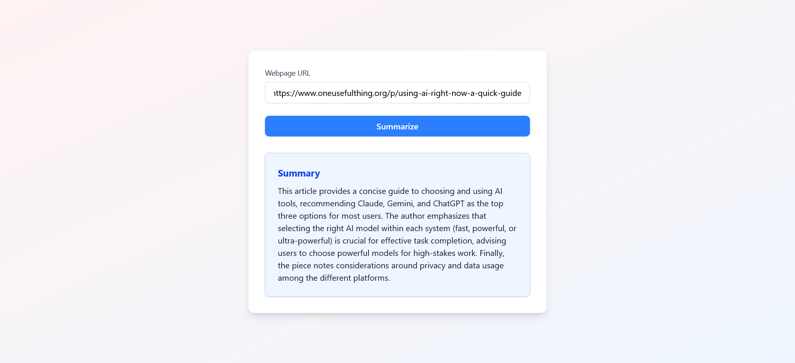

# 🧠 Web Page Summarizer (React + Express + Gemini AI)



A full-stack monorepo application that summarizes any web page content using Google's Gemini Pro AI model. Built with React, Express, and the Gemini SDK.

---

## 📁 Project Structure

```

web-summarizer/
├── apps/
│   ├── client/    → Frontend (React + Vite)
│   └── server/    → Backend (Express + Gemini SDK)
├── package.json   → Root monorepo with workspaces
├── .gitignore     → Global ignores

````

---

## 🚀 Features

- 🌐 Input a URL to any public web page
- 🔍 Server scrapes, cleans, and summarizes the content
- 🧠 Uses Google Gemini Flash (1.5) for intelligent summarization
- 🧰 Built as a monorepo with separate client/server apps
- 🔐 Secured `.env` for API key management

---

## 📦 Tech Stack

| Layer     | Tech                                |
|-----------|-------------------------------------|
| Frontend  | React + TypeScript + Vite           |
| Backend   | Express.js + TypeScript             |
| AI Model  | Google Gemini 1.5 Flash (via SDK)         |
| Parsing   | Axios + Cheerio (HTML scraping)     |
| Env Mgmt  | dotenv                               |

---

## 🛠 Setup Instructions

### 1. Clone the repo

```bash
git clone https://github.com/itsahmadawais/webpage-summarization-gemini.git
cd web-summarizer
````

### 2. Install all dependencies

```bash
npm install
```

### 3. Configure `.env` for Gemini API

Create a file: `apps/server/.env`

```env
GEMINI_API_KEY=your-gemini-api-key-here
```

> 💡 Get your Gemini API key from [https://makersuite.google.com/app/apikey](https://makersuite.google.com/app/apikey)

---

## 💻 Development

Run both frontend and backend together:

```bash
npm run dev
```

Or individually:

```bash
# Run backend (Express)
npm run dev --workspace=apps/server

# Run frontend (React)
npm run dev --workspace=apps/client
```

---

## 🌐 Usage

1. Open the frontend in your browser: [http://localhost:5173](http://localhost:5173)
2. Paste a public web page URL
3. Get an instant summary using Gemini AI

---

## 📦 Deployment (Optional)

You can deploy:

* Frontend: to Vercel, Netlify, or Firebase Hosting
* Backend: to Render, Railway, or Fly.io

---

## 🔐 Security Note

Make sure `.env` is **NOT committed**. It’s already included in:

```
apps/server/.gitignore
```

---

## 📄 License

MIT License — free to use and modify.

---

## 🤝 Contributions

Contributions, issues, and suggestions are welcome!
Feel free to open a PR or issue.

---

## 🧑‍💻 Author

**Awais Ahmad** — [@itsahmadawais](https://github.com/itsahmadawais)